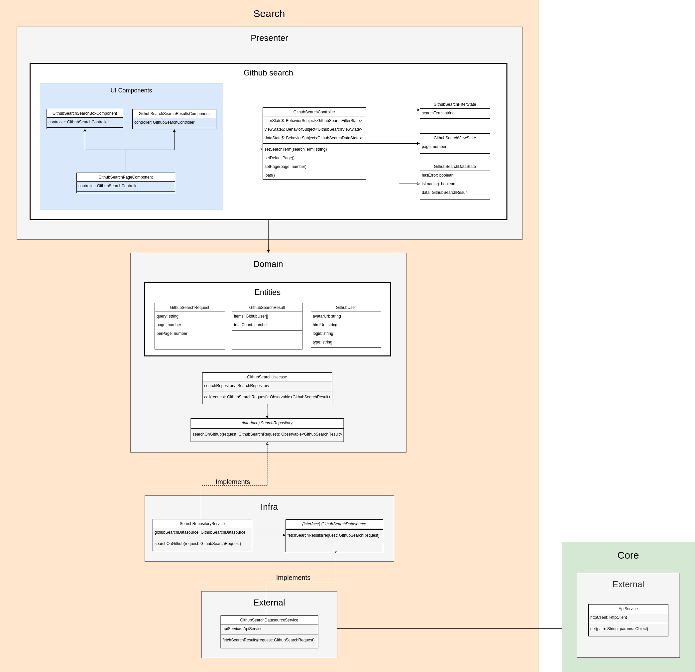

# ScalioChallenge

This project is a web application that uses the [GitHub REST API](https://docs.github.com/en/rest) for [search users](https://docs.github.com/en/rest/users/users).

## Deliverables

- Public WebApp URL: https://github-search-f7f52.web.app/
- Tests coverage result: https://github-search-tests-coverage.web.app/

## About challenge execution

### Implementation aspects

### CI/CD configuration:

The project has a GitHub Workflow that run the tests, build and deploy to firebase hosting. The CI/CD workflow is executed after every push on branch `master`, and after create or update a pull request. 

### Cypress integration

Besides unit and integration tests with Karma, the project also has e2e tests that are accomplished by cypress. Tests results can be viewed at: https://dashboard.cypress.io/projects/17oynf/runs. The configured GitHub Workflow always execute the e2e tests with Cypress, and register the tests results in Cypress Dashboard.

### Sorting

Sorting needed to be executed in frontend code. The reason is because the `/search/users` endpoint doesn't support sorting by `avatar_url`, `login` or `type`. By [GitHub Docs](https://docs.github.com/pt/rest/search#search-users), the this endpoint only allow sort by **number of followers**, **number of repositories** or **when the person joined GitHub**.
   

### Application architecture

This application was implemented driven by **Clean Dart**, a **Clean Architecture** approach idealized by Flutterando Team for help to develop projects with best code quality ([Clean Dart Docs](https://github.com/Flutterando/Clean-Dart)).

The **Clean Dart** proposes four layers for each application domain:
- Presenter: Responsible for implement all UI aspects, from UI basic components to UI state management.
- Domain: Responsible for implement business rules.
- Infra: Responsible for the intermediate the communication between domain and external datasources and drivers.
- External: Responsible for implement the direct communication to datasources and drivers.

Clean Dart Architecture (Flutterando)

For this web application, the architecture was implemented based on diagram bellow:

## Execution in development server

Run `npm run start` for a dev server. Navigate to `http://localhost:4200/`.

## Build

Run `npm run build` to build the project. The build artifacts will be stored in the `dist/` directory.

## Running unit tests

Run `npm run test` to execute the unit tests via [Karma](https://karma-runner.github.io). The tests coverage can be visualized in `coverage/scalio-challenge/index.html` file.

## Running end-to-end tests

Run `npm run e2e` to execute the end-to-end with Cypress.